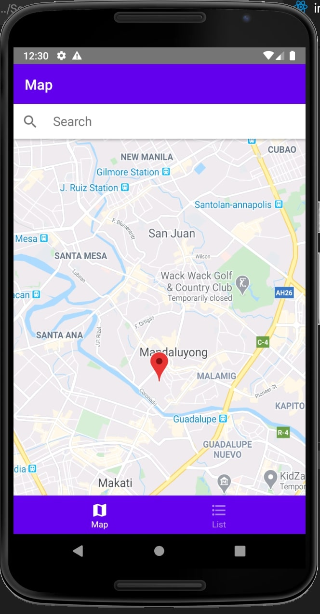
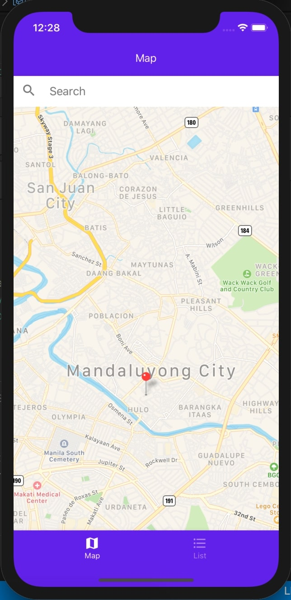

## Installation
```bash
yarn install
```

## local.properties
create local.properties in android/ and add sdk.dir=path/to/your/Android/sdk

## Setup Maps API Key
set your google maps api key at android/app/src/main/AndroidManifest.xml
<meta-data android:name="com.google.android.geo.API_KEY" android:value="your key"/>

## Set default Map location
set the default initialState location in src/store/context/index.tsx


## Screenshots

